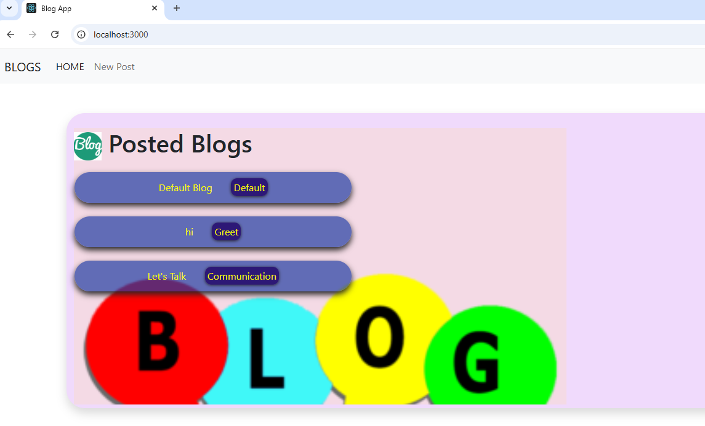
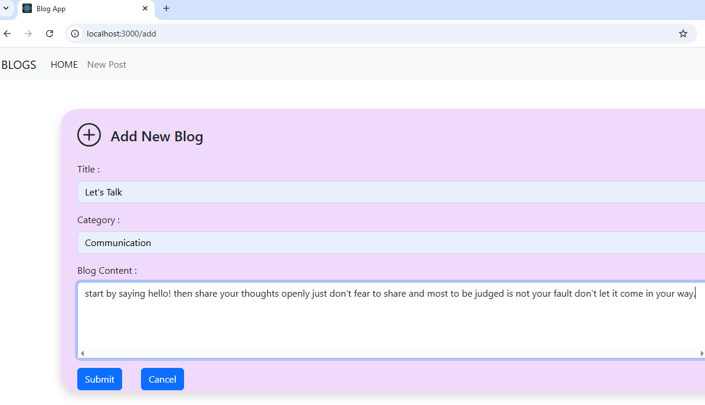
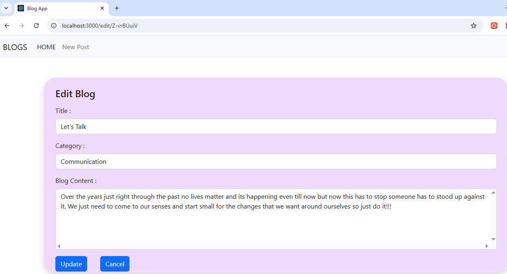

# 📝 Blog Post App

A simple and elegant CRUD-based blog application built with **React**, **Redux**, and **Bootstrap**. This project allows users to create, view, edit, and delete blog posts. Ideal for learning frontend development, state management with Redux, and practicing React fundamentals.

## 🚀 Features

- 🧾 Add new blog posts
- ✏️ Edit existing posts
- 🗑️ Delete posts
- 📄 View all blogs on the homepage
- 📦 Unique IDs for each post using `shortid`
- 🔥 Toast notifications with `react-toastify`
- ⚙️ Clean and responsive UI with Bootstrap

## 🧰 Tech Stack

- **Frontend**: React, Redux, React Router, Bootstrap
- **State Management**: Redux
- **Routing**: React Router DOM
- **Notifications**: React Toastify
- **ID Generation**: ShortID

## 📷 Screenshots

### 🏠 Blog Homepage


### ➕ Add Blog


### ✏️ Editing Blog


### ❌ Delete Blog


## 📦 Installation

1. **Clone the repository**

```bash
git clone https://github.com/Neeraj102001/Web_Blog.git
cd Web_Blog


**2. **Install dependencies****
npm install

*3. **To Run the app****
npm start
The app will be available at http://localhost:3000.


📁 Project Structure
/src
 ┣ /components
 ┃ ┣ AddBlog.js
 ┃ ┣ EditBlog.js
 ┃ ┣ BlogList.js
 ┣ /redux
 ┃ ┣ actions.js
 ┃ ┣ reducers.js
 ┃ ┣ store.js
 ┣ App.js
 ┣ index.js

**✅ To-Do**
>Add persistent backend (e.g., Firebase, Node.js + MongoDB).
>Add user authentication
>Improve mobile responsiveness
>Enable image uploads in blog posts

**🙌 Contribution**
Feel free to fork the repo, make changes, and submit a pull request. All contributions are welcome!

**📄 License**
This project is open-source and available under the MIT License.

